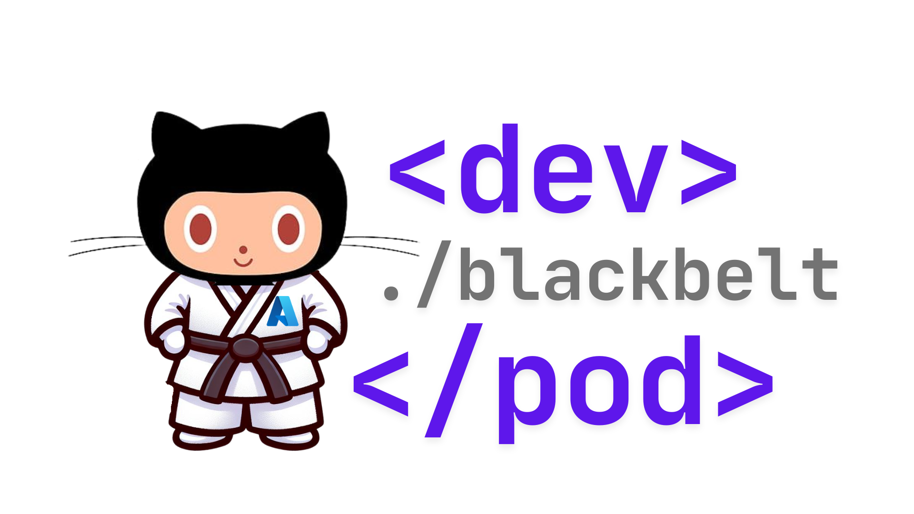

# 🚀 El Programa Dev Pods: Pionero en la Excelencia de Desarrolladores

[🇺🇸 English](./README.md) | 
[🇧🇷 Português (Brasil)](./README-pt-BR.md)

## 🌟 Transformando el Desarrollo a Través de Comunidades de Élite

El Programa Dev Pods representa un enfoque revolucionario hacia la excelencia en desarrollo – una iniciativa exclusiva, solo por invitación, diseñada para transformar cómo las organizaciones construyen software en la era de la IA. Durante seis meses transformadores, las organizaciones seleccionadas embarcarán en un viaje hacia una productividad extraordinaria de desarrolladores, estableciendo comunidades internas de virtuosos técnicos que impulsarán la innovación por años venideros.

Esto no es solo capacitación – es transformación organizacional.

## 💎 Por Qué Dev Pods Se Destaca

En un panorama lleno de talleres técnicos y certificaciones, el Programa Dev Pods ofrece algo verdaderamente distintivo: la creación de centros de excelencia autosostenibles que continúan entregando valor mucho después de que concluya el programa formal. Nuestro enfoque ha sido meticulosamente elaborado a través de la colaboración con pioneros de la industria para abordar los desafíos más apremiantes en el desarrollo moderno.

**El programa ofrece resultados excepcionales a través de su enfoque único:**

- **Excelencia Impulsada por la Comunidad**: A diferencia de capacitaciones aisladas que se desvanecen con el tiempo, establecemos comunidades duraderas de Cinturón Negro que se convierten en catalizadores para la mejora continua.
- **Integración Transformadora con IA**: Domine herramientas de desarrollo de IA de vanguardia que amplifican dramáticamente las capacidades y productividad de los desarrolladores.
- **Arquitectura Estratégica del Conocimiento**: Construya sistemas que capturan, preservan y comparten conocimiento crítico de desarrollo en toda su organización.
- **Liderazgo Técnico de Élite**: Cultive la próxima generación de líderes técnicos que conectan la visión de negocio con la ejecución técnica.
- **Ciclos de Innovación Acelerados**: Implemente prácticas que reducen drásticamente el tiempo desde el concepto hasta el código listo para producción.

## ❓ Preguntas Frecuentes

¿Tiene preguntas sobre el Programa Dev Pods? Consulte nuestras [Preguntas Frecuentes (FAQ)](./docs/faq.md) para obtener respuestas sobre requisitos del programa, compromiso de tiempo, proceso de certificación y cómo este programa difiere de la capacitación técnica tradicional.

## 🔄 El Exclusivo Viaje de Transformación de Seis Meses

El Programa Dev Pods guía a los participantes a través de una progresión cuidadosamente estructurada que construye maestría desde los fundamentos hasta la innovación avanzada:

### Fase de Fundación: Dominando los Fundamentos del Desarrollo
- **[Nivel 00 - Maestría en Git](./content/git-basics/)**: Establezca excelencia en control de versiones como la base para todo lo que sigue
- **[Nivel 50 - Colaboración en GitHub](./content/github-basics/)**: Transforme cómo los equipos colaboran, revisan y gestionan código juntos

### Fase de Aceleración: Aprovechando la IA para el Desarrollo
- **[Nivel 100 - Fundamentos de GitHub Copilot](https://github.com/paulanunes85/Mastering-GitHub-Copilot-for-Paired-Programming-pt-br/blob/main/README.es.md)**: Comience el viaje del desarrollo aumentado por IA con instalación, verificación y dominio de técnicas básicas de solicitud
- **[Nivel 200 - Maestría en IA Específica por Lenguaje](https://github.com/paulanunes85/Mastering-GitHub-Copilot-for-Paired-Programming-pt-br/blob/main/README.es.md)**: Profundice la experiencia con JavaScript, Python y C# a través de asistencia de IA y uso avanzado de comandos slash e interfaces de chat
- **[Nivel 300 - Ingeniería de Datos Potenciada por IA](https://github.com/paulanunes85/Data-With-GitHub-Copilot-pt-br/blob/main/README.es.md)**: Revolucione cómo trabaja con datos utilizando capacidades avanzadas de IA en entornos CI/CD y pipelines de datos

### Fase de Excelencia: Construyendo Capacidades Organizacionales
- **[Nivel 200 - Integración Avanzada de Seguridad](https://github.com/paulanunes85/Github-Advanced-Security-Workflow-pt-br)**: Implemente prácticas de seguridad potenciadas por IA que previenen vulnerabilidades y mantienen la salud de las dependencias
- **[Nivel 300 - Ingeniería de Migración Estratégica](https://github.com/paulanunes85/Migration-GH-Actions-Importer-pt-br)**: Domine el arte de la migración perfecta con GitHub Actions Importer y planificación estructurada de migración

### Fase de Innovación: Liderando el Futuro
- **[Nivel 400 - Extensiones Personalizadas de IA](https://github.com/paulanunes85/Build-Custom-Copilot-Extensions-pt-br)**: Cree herramientas propietarias de IA adaptadas a las necesidades únicas de su organización y publique en GitHub Marketplace
- **[Nivel 400 - Liderazgo en Ingeniería de Plataforma](https://github.com/paulanunes85/hands-on-lab-platform-engineering-for-devs-pt-br)**: Establezca entornos de desarrollo de próxima generación que simplifican la gestión de Azure y el despliegue de software

## ⚔️ La Élite de Cinturón Negro: Sus Campeones Internos

La joya de la corona del Programa Dev Pods es la formación de comunidades de Cinturón Negro – un cuadro de élite de virtuosos técnicos que impulsarán la excelencia continua dentro de su organización. Estos individuos excepcionales:

- Se transforman de desarrolladores a **líderes técnicos estratégicos**
- Se convierten en el centro de **innovación técnica y transferencia de conocimiento**
- Establecen **centros de excelencia** que continuamente elevan toda su organización de desarrollo
- Crean **ventajas competitivas medibles** a través de la excelencia técnica
- Construyen el puente entre la **visión de negocio y la ejecución técnica**

Organizaciones con comunidades de Cinturón Negro establecidas reportan **40% más rápida incorporación de nuevos desarrolladores**, **63% de reducción en problemas críticos de producción**, y una **notable tasa de satisfacción del 94%** entre equipos técnicos. Estas comunidades impulsan la mejora continua mucho tiempo después de que concluya el programa formal.

[Explore la comunidad exclusiva de Cinturón Negro →](./content/black-belt-community/)

## 🎓 Certificaciones Oficiales de GitHub

Como parte del programa Dev Pods, los participantes reciben vouchers para certificaciones oficiales de GitHub que validan su experiencia y mejoran sus credenciales profesionales:

### Certificación GitHub Foundations
- Valida la comprensión de los fundamentos de GitHub
- Disponible en inglés, portugués, español, coreano, japonés
- [Regístrese para certificación →](https://examregistration.github.com/certification/GHF)

### Certificación GitHub Copilot
- Valida la experiencia con el desarrollo asistido por IA
- Abarca ingeniería de prompts, prácticas responsables de IA y flujos de trabajo de desarrollador
- [Regístrese para certificación →](https://examregistration.github.com/certification/COPILOT)

### Certificación GitHub Advanced Security
- Valida la experiencia con características y prácticas de seguridad
- Incluye escaneo de secretos, revisión de dependencias y escaneo de código con CodeQL
- [Regístrese para certificación →](https://examregistration.github.com/certification/GHAS)

Los vouchers de certificación se distribuyen en etapas apropiadas del programa para alinearse con las habilidades que se están desarrollando.

## 🌊 El Viaje Transformador

| Fase | Actividades Transformadoras | Resultados Organizacionales |
|-------|---------------------------|------------------------|
| Mes 1 | Fundamentos de Excelencia en Git y GitHub | Establecer flujos de trabajo colaborativos que eliminan silos |
| Mes 2 | Iniciación al Desarrollo Asistido por IA | Experimentar los primeros avances en productividad |
| Mes 3 | Maestría en IA Específica por Lenguaje | Ver aceleración dramática en producción y calidad de código |
| Mes 4 | Revolución en Ingeniería de Datos y Maestría en Migración | Desbloquear capacidades avanzadas preservando inversiones existentes |
| Mes 5 | Hackathon de Innovación y Extensiones Personalizadas de IA | Crear ventajas competitivas propietarias |
| Mes 6 | Ingeniería de Plataforma y Certificación de Cinturón Negro | Establecer comunidades de excelencia autosostenibles |

[Vea la hoja de ruta completa de transformación →](./content/events/)

## 📈 Marco de Beneficios del Programa

El Programa Dev Pods entrega valor en múltiples dimensiones:

### Eficacia del Desarrollador
- Productividad mejorada a través del desarrollo asistido por IA
- Calidad de código mejorada y reducción de defectos
- Colaboración y compartición de conocimiento optimizadas
- Utilización optimizada de recursos
- Incorporación y desarrollo de habilidades acelerados

### Desarrollo Profesional
- Certificaciones de GitHub reconocidas por la industria
- Oportunidades de liderazgo técnico
- Experiencia especializada en herramientas de vanguardia
- Habilidades de mentoría y coaching
- Vías de avance profesional

### Transformación Organizacional
- Cambio de desarrollo aislado a excelencia colaborativa
- Evolución de prácticas reactivas a prácticas proactivas de calidad
- Transformación del acaparamiento de conocimiento a compartición estratégica
- Elevación de desarrolladores de escritores de código a solucionadores estratégicos de problemas
- Innovación continua incorporada en el ADN organizacional

### Ventajas Estratégicas
- Comunidades autorreafirmantes de excelencia técnica
- Mejoras en atracción y retención de talento
- Sistemas sostenibles de preservación de conocimiento
- Prácticas de desarrollo personalizadas para desafíos únicos
- Calidad de software consistentemente superior

[Vea nuestro marco completo de beneficios →](./content/benefits/)

## 🔄 Elementos Completos del Programa

El Programa Dev Pods ofrece un sistema completo de transformación:

### Infraestructura de Excelencia
- Rutas de aprendizaje de nivel empresarial con maestría progresiva
- Talleres prácticos facilitados por expertos de la industria
- Hackathons personalizados que abordan sus desafíos específicos
- Marcos exclusivos de certificación y reconocimiento

### Construcción de Comunidad
- Desarrollo de liderazgo para candidatos a Cinturón Negro
- Sistemas de colaboración que preservan y amplifican el conocimiento
- Mecanismos de mejora continua que evolucionan con su organización
- Marcos internos de mentoría que multiplican la experiencia

### Sostenibilidad a Largo Plazo
- Arquitecturas de preservación de conocimiento que sobreviven a la rotación de empleados
- Incubadoras de innovación que impulsan el avance continuo
- Comunidades autosostenibles que se fortalecen con el tiempo
- Integración con la estrategia de negocio para máximo impacto organizacional

## 🤝 Alianzas Estratégicas

El programa Dev Pods opera en colaboración con socios tecnológicos de élite que mejoran y extienden las capacidades del programa.

[Descubra nuestra red de alianzas estratégicas →](./content/partners/)

## 📄 Licencia

Este proyecto está licenciado bajo la Licencia MIT - vea el archivo [LICENSE](LICENSE) para más detalles.

---

<b>Programa Dev Pods: Estableciendo Islas de Excelencia en el Océano del Desarrollo</b> 
© 2025 Developer Productivity, Global Black Belt y Developer Relations Team de Microsoft

