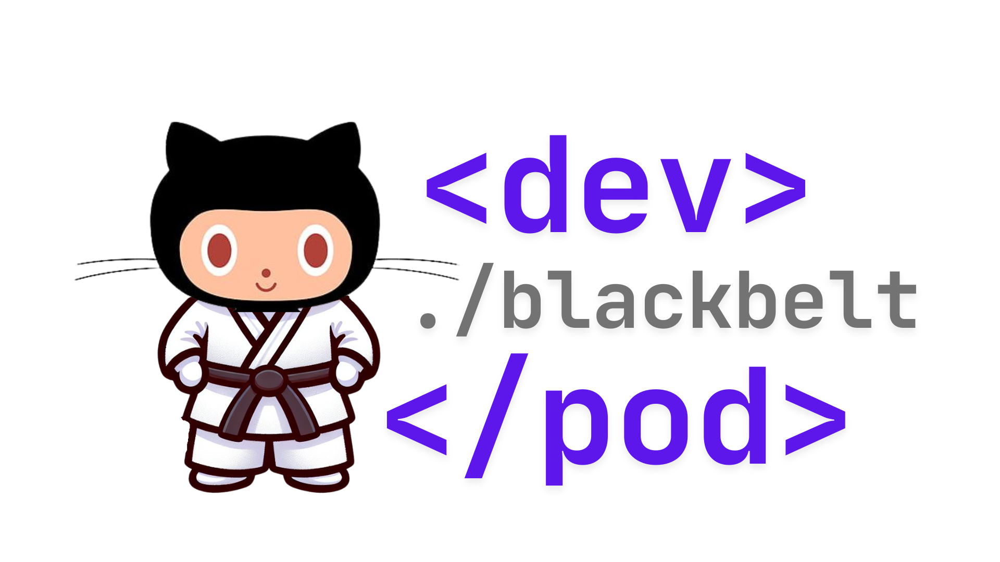

<!--
Original file: /README.md
English version: 2023-03-20
Last translation update: 2023-03-20
Translated by: Paula Silva
-->

# 🚀 Programa Dev Pods: Pioneirismo na Excelência de Desenvolvedores

  

[🇺🇸 English](../../README.md) | 
[🇪🇸 Español (Latinoamérica)](../es-LATAM/README.md)

## 🌟 Transformando o Desenvolvimento Através de Comunidades de Elite

O Programa Dev Pods representa uma abordagem revolucionária para a excelência de desenvolvedores – uma iniciativa exclusiva, apenas por convite, projetada para transformar como as organizações constroem software na era da IA. Durante seis meses transformadores, organizações selecionadas embarcarão em uma jornada para uma produtividade extraordinária de seus desenvolvedores, estabelecendo comunidades internas de virtuoses técnicos que impulsionarão a inovação por anos.

Isso não é apenas treinamento – é transformação organizacional.

## 💎 Por Que o Dev Pods Se Destaca

Em um cenário repleto de workshops técnicos e certificações, o Programa Dev Pods oferece algo verdadeiramente distintivo: a criação de centros de excelência autossustentáveis que continuam entregando valor muito depois que o programa formal é concluído. Nossa abordagem foi meticulosamente elaborada através da colaboração com pioneiros da indústria para enfrentar os desafios mais urgentes no desenvolvimento moderno.

**O programa oferece resultados excepcionais através de sua abordagem única:**

- **Excelência Orientada por Comunidade**: Diferente de treinamentos pontuais que se dissipam com o tempo, estabelecemos comunidades Black Belt duradouras que se tornam catalisadoras de melhoria contínua.
- **Integração Transformadora com IA**: Domine ferramentas de desenvolvimento com IA de ponta que amplificam drasticamente as capacidades e a produtividade dos desenvolvedores.
- **Arquitetura Estratégica de Conhecimento**: Construa sistemas que capturam, preservam e compartilham conhecimento crítico de desenvolvimento em toda a sua organização.
- **Liderança Técnica de Elite**: Cultive a próxima geração de líderes técnicos que conectam a visão de negócios com a execução técnica.
- **Ciclos de Inovação Acelerados**: Implemente práticas que reduzem drasticamente o tempo desde o conceito até o código pronto para produção.

## 🔄 A Jornada Exclusiva de Transformação de Seis Meses

O Programa Dev Pods guia os participantes através de uma progressão cuidadosamente estruturada que constrói maestria desde os fundamentos até a inovação avançada:

### Fase de Fundação: Dominando os Fundamentos de Desenvolvimento
- **Nível 00 - Maestria em Git**: Estabeleça a excelência em controle de versão como fundação para tudo que segue
- **Nível 50 - Colaboração no GitHub**: Transforme como as equipes colaboram, revisam e gerenciam código juntas

### Fase de Aceleração: Aproveitando a IA para o Desenvolvimento
- **Nível 100 - Fundamentos do GitHub Copilot**: Inicie a jornada de desenvolvimento potencializado por IA
- **Nível 200 - Maestria em IA Específica para Linguagens**: Aprofunde a expertise com JavaScript, Python e C# através da assistência de IA
- **Nível 300 - Engenharia de Dados Potencializada por IA**: Revolucione como você trabalha com dados usando capacidades avançadas de IA

### Fase de Excelência: Construindo Capacidades Organizacionais
- **Nível 200 - Integração Avançada de Segurança**: Implemente práticas de segurança potencializadas por IA que protegem enquanto aceleram
- **Nível 300 - Engenharia Estratégica de Migração**: Domine a arte da migração perfeita com mínima interrupção

### Fase de Inovação: Liderando o Futuro
- **Nível 400 - Extensões Personalizadas de IA**: Crie ferramentas proprietárias de IA adaptadas às necessidades únicas da sua organização
- **Nível 400 - Liderança em Engenharia de Plataforma**: Estabeleça ambientes de desenvolvimento de próxima geração que multiplicam a produtividade

## ⚔️ A Elite Black Belt: Seus Campeões Internos

A joia da coroa do Programa Dev Pods é a formação de comunidades Black Belt – um grupo de elite de virtuoses técnicos que impulsionarão a excelência contínua dentro da sua organização. Esses indivíduos excepcionais:

- Transformam-se de desenvolvedores para **líderes técnicos estratégicos**
- Tornam-se o centro de **inovação técnica e transferência de conhecimento**
- Estabelecem **centros de excelência** que continuamente elevam toda a sua organização de desenvolvimento
- Criam **vantagens competitivas mensuráveis** através da excelência técnica
- Conectam a **visão de negócios com a execução técnica**

Organizações com comunidades Black Belt estabelecidas relatam **40% mais rapidez na integração de novos desenvolvedores**, **63% de redução em problemas críticos de produção** e uma **notável taxa de satisfação de 94%** entre as equipes técnicas. O retorno sobre o investimento torna-se evidente à medida que essas comunidades impulsionam a melhoria contínua muito depois da conclusão do programa formal.

[Saiba mais sobre a Proposta de Valor Black Belt →](../../docs/black_belt_value.md)

## 🌊 A Jornada Transformadora

| Fase | Atividades Transformadoras | Resultados Organizacionais |
|-------|---------------------------|------------------------|
| Mês 1 | Fundamentos de Excelência em Git e GitHub | Estabeleça fluxos de trabalho colaborativos que eliminam silos |
| Mês 2 | Iniciação ao Desenvolvimento Assistido por IA | Experimente os primeiros avanços de produtividade |
| Mês 3 | Maestria em IA Específica para Linguagens | Veja aceleração dramática na produção e qualidade de código |
| Mês 4 | Revolução na Engenharia de Dados e Maestria em Migração | Desbloqueie capacidades avançadas enquanto preserva investimentos existentes |
| Mês 5 | Hackathon de Inovação e Extensões Personalizadas de IA | Crie vantagens competitivas proprietárias |
| Mês 6 | Engenharia de Plataforma e Certificação Black Belt | Estabeleça comunidades de excelência autossustentáveis |

[Veja o cronograma completo de implementação →](../../docs/implementation_timeline.md)

## 📈 Transformação Organizacional Comprovada

Organizações que completam o Programa Dev Pods experimentam resultados transformadores que impactam diretamente o sucesso dos negócios:

### Impacto Mensurável nos Negócios
- **89% de redução** no tempo gasto em tarefas rotineiras de codificação
- **72% de diminuição** no tempo necessário para revisões de código
- **94% mais rápido** na identificação e resolução de bugs
- **217% de aumento** na velocidade de entrega de recursos
- **40% de melhoria** nas métricas de segurança de código

### Transformação Cultural
- Mudança do desenvolvimento isolado para a excelência colaborativa
- Evolução de práticas reativas para proativas de qualidade
- Transformação do acúmulo de conhecimento para o compartilhamento estratégico
- Elevação dos desenvolvedores de escritores de código para solucionadores estratégicos de problemas
- A inovação contínua torna-se incorporada no DNA organizacional

### Vantagens Estratégicas
- Construa uma comunidade autorreforçadora de excelência técnica
- Crie um ambiente magnético que atrai e retém os melhores talentos
- Estabeleça sistemas sustentáveis de preservação de conhecimento
- Desenvolva práticas de desenvolvimento proprietárias adaptadas aos seus desafios únicos
- Alcance qualidade de software consistentemente superior que impulsiona resultados de negócios

[Veja nosso framework abrangente de medição →](../../docs/measurement_framework.md)

## 🔄 Elementos Abrangentes do Programa

O Programa Dev Pods oferece um sistema completo de transformação:

### Infraestrutura de Excelência
- Caminhos de aprendizado de nível empresarial com maestria progressiva
- Workshops práticos facilitados por especialistas da indústria
- Hackathons personalizados que abordam seus desafios específicos
- Frameworks exclusivos de certificação e reconhecimento

### Construção de Comunidade
- Desenvolvimento de liderança para candidatos Black Belt
- Sistemas de colaboração que preservam e amplificam o conhecimento
- Mecanismos de melhoria contínua que evoluem com sua organização
- Frameworks internos de mentoria que multiplicam a expertise

### Sustentabilidade a Longo Prazo
- Arquiteturas de preservação de conhecimento que sobrevivem à rotatividade de funcionários
- Incubadoras de inovação que impulsionam o avanço contínuo
- Comunidades autossustentáveis que se fortalecem com o tempo
- Integração com a estratégia de negócios para máximo impacto organizacional

## 📚 Documentação do Programa

### Recursos Principais
- [Visão Geral do Programa](../../docs/overview.md)
- [Objetivos do Programa](../../docs/objectives.md)
- [Guia da Comunidade Black Belt](../../docs/community/guide.md)
- [Proposta de Valor Black Belt](../../docs/black_belt_value.md)

### Detalhes de Implementação
- [Cronograma de Implementação](../../docs/implementation_timeline.md)
- [Desafios e Gestão de Riscos](../../docs/challenges.md)
- [Framework de Medição](../../docs/measurement_framework.md)
- [Programa de Treinamento](../../docs/training_program.md)

### Níveis do Programa
- [Nível 1: Fundamentos](../../docs/levels/level1.md)
- [Nível 2: Aplicação Avançada](../../docs/levels/level2.md)
- [Nível 3: Maestria e Inovação](../../docs/levels/level3.md)

## 🌐 Idiomas

Este projeto está disponível em múltiplos idiomas. Veja nosso [Status de Tradução](../../TRANSLATION_STATUS.md) para detalhes.

- [🇺🇸 English](../../README.md)
- [🇪🇸 Español (Latinoamérica)](../es-LATAM/README.md)

## 🤝 Contribuição

Contribuições para este repositório são bem-vindas. Veja o [guia de contribuição](../../CONTRIBUTING.md) para detalhes.

## 📋 Código de Conduta

Este projeto adere a um [Código de Conduta](../../CODE_OF_CONDUCT.md) que todos os participantes devem seguir.

## 📄 Licença

Este projeto está licenciado sob a Licença MIT - veja o arquivo [LICENSE](../../LICENSE) para detalhes.

---

<b>Programa Dev Pods: Estabelecendo Ilhas de Excelência no Oceano do Desenvolvimento</b> 

